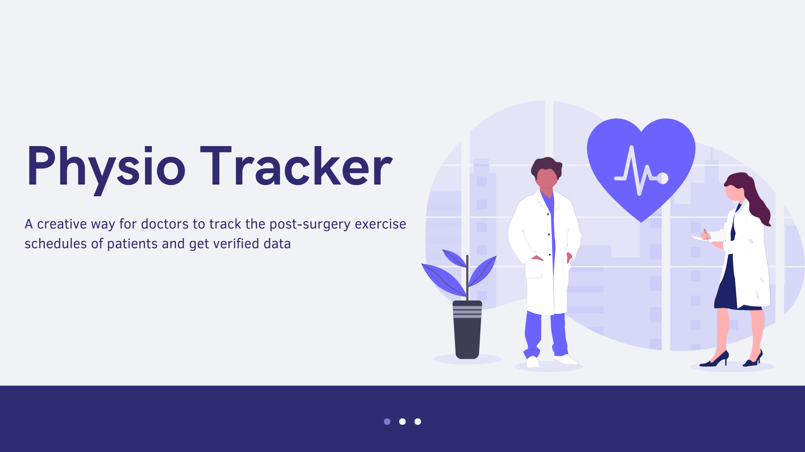
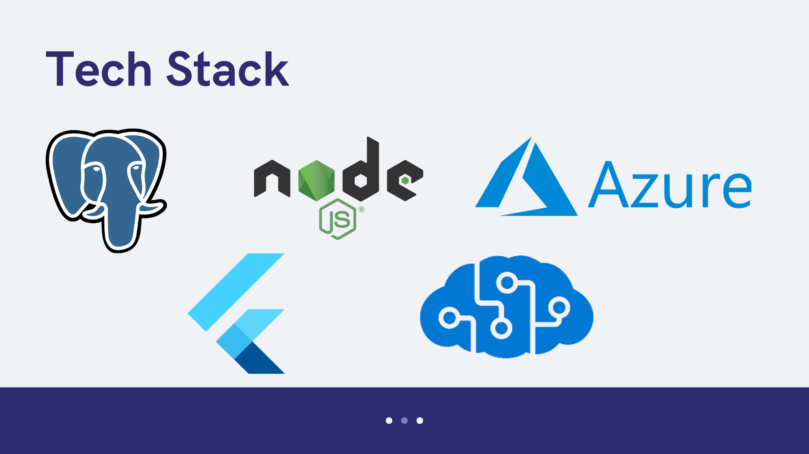

# Physio Tracker

  

**Physio-Tracker** is a first of its kind app ecosystem for ortho surgeons and their patients, to track the post-surgery exercise schedules of patients with two-factor confirmation by treating the patient's relatives as the authenticating party of the patient exercise records.

## Inspiration
We got inspired by an incident that happened a while back. One of our close friends injured his knee badly while playing football. After diagnosis, knee surgery was performed, and it had to be followed by a regular exercise schedule. We observed that our friend was not sticking to the schedule, and even though we tried to convince him for the same, it was of no use. 

In the end, we had to approach the doctor to inform him of the situation, and then the doctor told us that this happens very frequently. We got to know that the patients often don't follow the exercise schedule, which leads to the surgery not being as successful as expected. 
Taking inspiration from this incident, we discussed the idea to develop an app to combat the problem, and this is how the idea was born.

## How it will work / How it will be built?
The application basically introduces a two-factor verification to increase compliance with exercise schedules by patients. Here patients and relatives connect with each other by sending friend requests, and doctors create exercise plans for the patient. Now the application helps patients follow the exercise schedule with a very user-friendly interface. Post-exercise completion, a request is automatically sent to added relatives to confirm the completion of the exercises. The relative's feedback is kept anonymous from the patient, and only the doctors can track the complete data.
Since the doctors have the actual feedback on whether the patient is following the schedule, they can take adequate measures to increase compliance. There are many other data analysis features in the doctor's app which helps them monitor the progress.

## Modules
1. **backend/**: Contains the backend codebase written in nodejs.
2. **docs/**: Contains the documentation assets like images etc
3. **doctor-app/**: Contains a cross platform flutter application for doctor to manage their patients
4. **patient-app/**: Contains a cross platform flutter application for patient and their relatives

## Tech Stack

